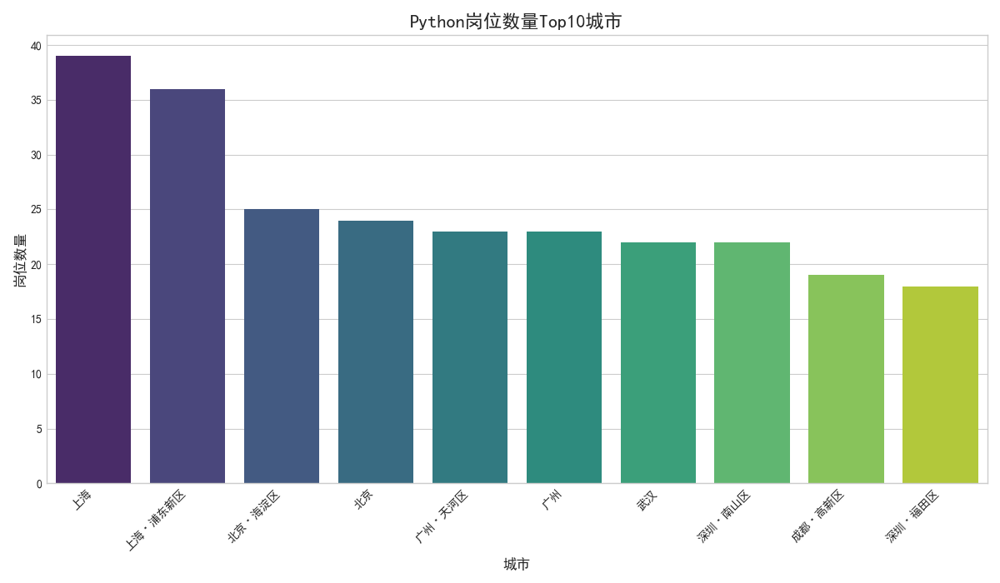

# 🐍 Python 职位市场分析平台

<div align="center">


</div>

> 一个端到端的Python职位数据分析系统，实现从数据采集、清洗、分析到可视化展示的全流程自动化。

---

## 🌟 项目亮点

-   **🎯 智能采集**：基于Selenium攻克JavaScript动态加载与复杂反爬策略。
-   **🧹 深度清洗**：利用Pandas对薪资、经验等非结构化数据进行精准解析。
-   **📊 多维分析**：从城市、薪资、技能需求等多个维度洞察市场趋势。
-   **🎨 交互式看板**：使用Streamlit构建数据产品级的Web可视化界面。

---

## 🛠️ 技术栈与架构

| 类别 | 主要技术 | 核心作用 |
| :--- | :--- | :--- |
| **数据采集** | `Selenium`, `BeautifulSoup` | 模拟浏览器行为，抓取动态网页内容。 |
| **数据处理** | `Pandas`, `NumPy` | 高效进行数据清洗、转换和数值计算。 |
| **数据可视化**| `Matplotlib`, `Seaborn`, `WordCloud`| 生成统计图表和词云，直观展示分析结果。 |
| **Web应用** | `Streamlit` | 快速将数据分析脚本构建为交互式Web应用。 |

<details>
<summary>👉 点击查看技术架构图</summary>

**▸ 数据采集层**  
   ├── 🔍 动态页面抓取 (Selenium)  
   └── 📦 输出：原始数据 CSV  

**▸ 数据处理层**  
   ├── 🧼 数据清洗 (Pandas)  
   ├── 🔢 数据分析 (NumPy)  
   └── 📦 输出：清洗后数据集  

**▸ 可视化层**  
   ├── 📊 图表生成 (Matplotlib/Seaborn)  
   ├── ☁️ 词云生成 (WordCloud)  
   └── 📦 输出：分析图表 PNG  

**▸ 应用层**  
   └── 🖥️ 交互式看板 (Streamlit)  

**完整流程：**  
1. 采集层 → 获取原始数据  
2. 处理层 → 提炼有价值信息  
3. 可视化层 → 创建直观图表  
4. 应用层 → 展示分析结果  

</details>

---

## 📂 项目文件结构
<details> <summary>👉 点击查看文件结构</summary>

```plaintext
📁 JobAnalysis/                        # 项目根目录
│
├── 📄 app.py                          # 🚀 Streamlit主应用入口
├── 📄 requirements.txt                # ⚙️ Python依赖库列表
├── 📄 README.md                       # 📖 项目文档(你现在看的这个文件)
│
├── 📁 scraper/                        # 🕸️ 数据采集模块
│   ├── 📄 job_scraper.py              # 动态网页爬虫主脚本
│   └── 📄 __init__.py                 # Python包标识文件
│
├── 📁 analysis/                       # 📊 数据分析模块
│   ├── 📄 data_analyzer.py            # 数据处理与分析脚本
│   └── 📄 __init__.py                 # Python包标识文件
│
├── 📁 drivers/                        # 🖥️ 浏览器驱动程序(可选)
│   └── 🔧 chromedriver.exe            # Chrome浏览器驱动
│
├── 📁 data/                           # 💾 数据存储目录(自动生成)
│   ├── 📝 jobs_raw.csv                # 原始网页抓取数据
│   └── 📝 jobs_cleaned.csv            # 清洗后的结构数据
│
├── 📁 output/                         # 🖼️ 分析结果目录(自动生成)
│   ├── 🎨 job_counts_by_city.png      # 职位城市分布图
│   ├── 💰 salary_by_city.png          # 城市薪资水平图
│   └── 🧠 skills_wordcloud.png        # 技能需求词云图
│
├── 📁 docs/                           # 📚 项目文档资源
│   └── 🖼️ demo.png                    # 项目截图/演示图
│
└── 📁 .git/                           # 🔒 Git版本控制目录(隐藏)
```

</details>

---

## ⚙️ 快速运行指南
<details open> <summary>👉 点击展开/折叠运行步骤</summary>

### ⚙️ 运行步骤

### 第一阶段：环境准备（必做）
```bash
# 克隆项目
git clone https://github.com/sincos1314/JobAnalysis.git
cd JobAnalysis
```
```bash
# 创建虚拟环境 [Windows]
python -m venv venv
venv\Scripts\activate

# 创建虚拟环境 [Linux/Mac]
python -m venv venv
source venv/bin/activate
```
```bash
# 安装依赖
pip install -r requirements.txt
```

### 第二阶段：爬虫配置（关键步骤）
```bash
# 需要在 scraper/job_scraper.py 中配置Cookie
# 从浏览器获取前程无忧Cookie并填入这行代码
# 大概在第15行左右位置：
COOKIES_STR = "你的Cookie字符串"
```

### 第三阶段：启动流程（核心操作）
```bash
# 运行爬虫（生成原始数据）
python scraper/job_scraper.py
```
```bash
# 运行分析（生成可视化图表）
python analysis/data_analyzer.py
```
```bash
# 启动Web应用（查看结果）
streamlit run app.py
```

**🛠 可选参数**

| 参数 |	说明	| 设置方式 |
| :--- | :--- | :--- |
| **MAX_PAGES** |	爬取页数	| 修改job_scraper.py中的默认值 |
| **KEYWORDS** |	职位关键词	| 修改job_scraper.py中的search_keywords |
| **CITIES** |	目标城市	| 修改job_scraper.py中的target_cities |

**❗ 注意事项**  
1. Cookie有效期约1天，过期后需重新获取  
2. 首次运行需等待数据采集（约5-10分钟）  
3. 数据分析脚本依赖data/jobs_raw.csv

</details>

---

## 🖼️ 效果预览 (示例)  
  
  
*▲ 城市职位布图*

---

## 💡 使用建议  
**爬虫配置**：定期更新Cookie确保爬虫有效性  
**可视化优化**：调整图表参数提升视觉效果  
**功能扩展**：在Web应用中添加更多交互控件  
**提示**：完整数据可在运行项目后生成于data/和output/目录  

---

## ⁉️ 常见问题  
Q: 为什么爬虫无法获取数据？  
A: 请确保：
>1. 已更新有效的Cookie  
>2. 目标网站未修改布局结构

Q: 图表无法正常显示？  
A: 请尝试：
>1. 升级依赖：pip install --upgrade matplotlib pandas  
>2. 检查输出文件路径

Q: Web应用报路径错误？  
A: 确认你已：
>1. 运行了爬虫和分析脚本  
>2. 所有文件都在项目根目录下运行